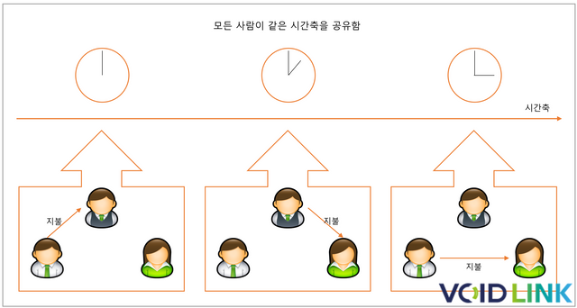

### 타임스탬프란?
2018-04-05 13:00:00와 같이 시간을 표현한 문자열

### 타임스탬프의 의의
타임스탬프는 어떠한 행위를 구분한는 데에 유용함

아래 그림으로 예시를 들자면

그림에서 거래는 총 3번 일어남 
하지만 거래의 시간이 모두 다르기 때문에 각각의 거래는 모두 시간을 기준으로 구분 가능함

### 현실세계의 타임스탬프
현실세계의 타임스탬프는 2가지 전제 하에 있음
- 모든 사람은 같은 시간축을 공유
- 시간은 되돌릴 수 없음

위 전제는 현실세계에 모두에게 모든 상황에 적용되기에 그저 행위가 일어난 시각을 기록하면 됨

대표적인 예시로 영수증이 있음

### 컴퓨터의 타임스탬프
컴퓨터에서는 위 현실세계의 전제가 적용되지 않기 때문에 합리적인 한가지 시간축을 정하여 판단함

대표적인 예시로 서버 시간을 시간축으로 정하는 사례임 
대부분의 서비스는 서버 시간을 시간축으로 정함

### 중앙집권적 타임스탬프
위와 같은 타임스탬프는 중앙집권적 타임스탬프임

중앙집권적 타임스탬프는 여러 단점이 있음
- 중앙 서버에 많은 부하가 걸린다
- 중앙 서버가 멈추면 서비스 전체가 멈춘다
- 개인이 조종 가능하기에 중앙에서 악의적인 행위를 하여도 막을 방도가 없다.

### 비중앙집권적 타임스탬프
중앙집권적 타임스탬프에 단점 때문에 비중앙집권적 타임스탬프가 탄생함

중앙집권적 타임스탬프는 현실세계의 타임스탬프의 전제를 암호학에 기초한 데이터 구조를 통해 구현하여 문제를 해결함

### 해시체인 타임스탬프
해시 알고리즘을 이용한 논리적 타임스탬프 구현

해시 알고리즘의 불가변적 특성을 이용하여 타임스탬프 구현 
모든 데이터를 헤시로 연결하여 헤시체인 구현

하지만 간단한 헤시체인으로는 해결못하는 문제들
- 모든 노드는 최신의 타임스탬프를 볼 수 있는가? 
    -> 데이터를 블록 단위로 묶어 해결
- 데이터를 변조할 경우, 변조 탐지를 할 수 있는가? 
    -> 머클트리를 활용