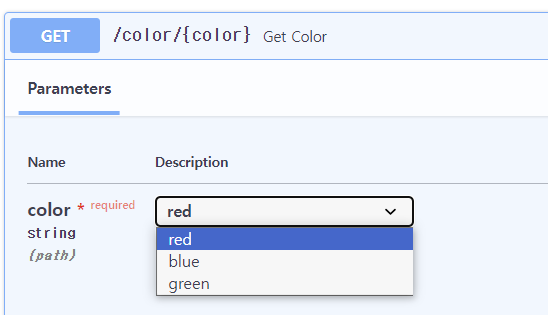

### 경로 매개변수
```py
from fastapi import FastAPI

app = FastAPI()

@app.get("/items/{item_id}") # 경로 매개변수 item_id의 값이
async def read_item(item_id): # 함수 item_id로 전달
    return {"item_id": item_id}
```

다음과 같이 타입을 지정할 수 있다
```py
from fastapi import FastAPI

app = FastAPI()

@app.get("/items/{item_id}")
async def read_item(item_id:int):
    return {"item_id": item_id}
``` 
또한 타입을 지정하면 데이터 검증또한 가능하다.

옳바른 매개변수 전달 -> http://127.0.0.1:8000/items/3
```
{"item_id": 3}
```

옳바르지 않는 매개변수 전달 -> http://127.0.0.1:8000/items/foo
```
{
    "detail": [
        {
            "loc": [
                "path",
                "item_id"
            ],
            "msg": "value is not a valid integer",
            "type": "type_error.integer"
        }
    ]
}
```
    
### 서순
위에 위치된 것을 우선으로 불러오기에 순서의 유의하자
```py
from fastapi import FastAPI

app = FastAPI()


@app.get("/users/me") # /user/me 라는 경로로 이동시 이걸 먼저 불러옴
async def read_user_me():
    return {"user_id": "the current user"}


@app.get("/users/{user_id}") # 만약 이게 먼저라면 read_user_me 함수는 절대 불러올 수 없음
async def read_user(user_id: str):
    return {"user_id": user_id}
```

### 사전정의 값
Enum을 사용하여 값을 사전의 정의 가능
```py
from enum import Enum
from fastapi import FastAPI

app = FastAPI()

class Color(str, Enum):
    red = "red"
    blue = "blue"
    green = "green"

@app.get("/color/{color}")
async def get_color(color: Color):
    if color is Color.blue: # 열거체 color와 열거형 멤버 Color.blue와 비교 가능
        return {"color": color, "message": "blue"}

    if color.value == "red":
        return {"color": color, "message": "red"}

    return {"color": color, "message": "green"}

```
이렇게 하면 준내 어-썸한 docs를 볼 수 있음

### 경로
매개변수가 경로를 포함하는 경우 `:path` 를 사용하여 경로를 포함함을 알려줌
```py
from fastapi import FastAPI

app = FastAPI()

@app.get("/files/{file_path:path}")
async def read_file(file_path: str):
    return {"file_path": file_path}
```