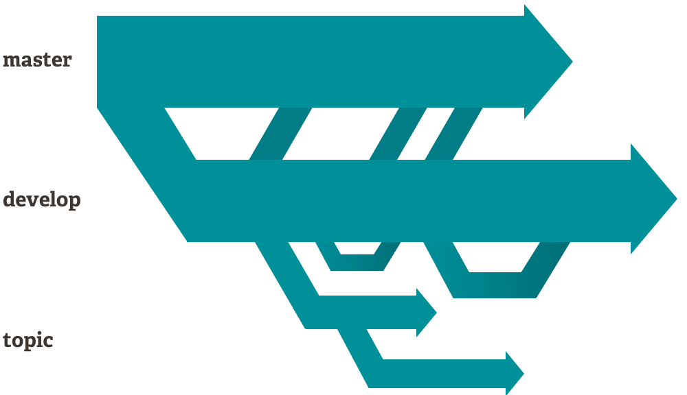
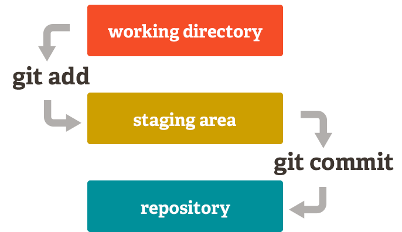

Git
===
##### 개발자라면 반드시 알아야 하는 분산 버전 관리 시스템(DVCS : Distributed version control systems)이다

---

Git의 특징
---
##### Git은 전체 소스 파일을 대상으로 해당 기능을 제공하고, 협업에 필요한 다양한 기능을 가지고 있다.

### 1. Branching and Merging
##### Branching and Mergingd은 갈래를 의미하는 branch와 병합을 의미하는 merge가 만난 합성어이다.
</img>

> ##### branch는 갈래라는 말과 같이 코드를 여러개로 복사하여 기존 코드와는 관계없이 독립적으로 개발을 진행할 수 있는데, 이렇게 독립적으로 개발하는 것이 브랜치다.
> ##### merge는 만들어진 branch들을 나중에 main brech와 병합한다.

### 2. Small and Fast
##### Git은 빠르다. C로 만들었고 분산 버전 관리 시스템이기 때문에 평소에 서버와 통신할 필요가 없고 대부분의 작업이 로컬에서 이루어진다.

### 3. Distributed
##### Git은 분산 관리형 시스템이다. 
> ##### 로컬에 원격 저장소의 모든 데이터를 복제하기 때문에 사실상 개발자 수만큼 백업이 되어 있다. 필요하면 원격 저장소를 여러 개 만들 수 있고 다양한 작업방식을 도입할 수 있다

### 4. Data Assurance
##### Git은 데이터 무결성을 보장한다.
>##### 모든 파일과 커밋(특정 상태를 기록한 것, 즉 버전을 의미)은 체크섬 검사를 하고, 특정 히스토리를 변경하면 해당 커밋 ID와 그 이후 모든 항목의 커밋 ID가 변경된다. 따라서 특정 커밋은 ID만 알면 변경되지 않았음을 확신할 수 있다. 대부분의 버전 관리 시스템이 이러한 무결성을 제공하지 않는다.
</img>

>##### Git은 커밋 이전에 스테이징staging area 또는 인덱스index라 불리는 상태를 가진다. 이 상태에서 커밋 내역을 검토하고 특정 파일만 먼저 커밋하고 일부 파일은 나중에 커밋할 수도 있다. 하지만 Git을 복잡하게 하는 단점도 있다.

### 5. Free and Open Source
##### Git은 오픈 소스 라이선스인 GNU General Public License version 2.0 (opens new window)를 가지고 모든 사용자에게 무료로 제공된다
---
## Git의 단점
##### 개같이 어려움
---
## 개인적 견해
#### 1. 기초만 배워라
- ##### 존나 어렵다. 필요한건 그떄그떄 구글링하자.
#### 2. 시작 설정 잘해놔라
- ##### 거기가 진짜 ㅈ같다 . 근대 그거 잘 해놔야 고생을 안한다.