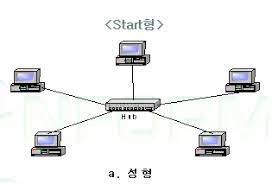
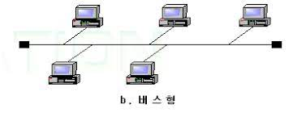
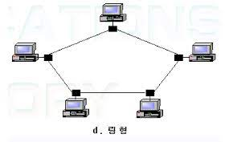

인터넷 -> 네트워클르 하나로 묶는 기술

### 토폴리지(topology)
LAN을 구성하는 형태  
LAN이 급속히 보급됨에 따라 다양한 형태의 토폴리지가 생김
- 별 형
    
    현제 가장 대중적인 토폴리지  
    CSMA/CD 프로토콜 사용

    

- 버스 형

    중앙에 데이터가 흐르는 버스를 두고 구성

    

- 링 형

    모든 기기를 하나의 원으로 연결 
    토큰 링(token ring) 프로토콜 사용

    

### ARPA
Advanced Reach Project Agency의 약자로 서로 호환되지 않던 LAN을 하나로 묶어 하나의 네트워크를 만들기 위한 연구

아파넷(ARPAnet)이 탄생 -> 프로토콜 필요

IP(Internetworking Protocol)탄생

### TCP/IP
IP를 사용하여 여러 LAN을 통과하는 과정에서 데이터가 손실되거나, 순서가 뒤바뀌거나, 일부가 훼손되는 일이 발생

-> TCP(Transmission Control Protocol) 탄생 
TCP는 전송제어 프로토콜로 IP의 오류를 보정함

---
모자이크 -> 최초의웹 브라우저
WWW -> World Wide wed
HTTP -> HyperText Transfer Protocol의 약자, 웹에서 사용

### P2P(Pear-to-Pear)
서버/클라이언트 구조 단점 -> 서버의 과부화 
-> 유저들 끼리 연결

중앙 집중식 P2P -> 서버 있음 
완전 P2P -> 서버 없음

### 분산 시스템
같은 작업을 여러게로 쪼개 개인용 컴퓨터에 분산시켜 처리

### 그리드 시스템
여러 곳에 떨어진 컴퓨팅 파워나 소프트웨어를 한나로 묶어 하나의 컴퓨터처럼 사용

### 클라우드 컴퓨팅
언제 어디서나 컴퓨팅 파워나 소프트웨어에 접근할 수 있는 유연한 컴퓨터 환경 
정보통신 자원을 이용자의 요구나 수요변화의 따라 정보통신망을 신축적으로 이용할 수 있도록 하는 정보처리 체계

하드웨어적 측면에서 그리드 기술을 사용

### 사물인터넷
IoT(Internet of Things)라 불리며 사물들을 인터넷으로 연결한 것 이다.