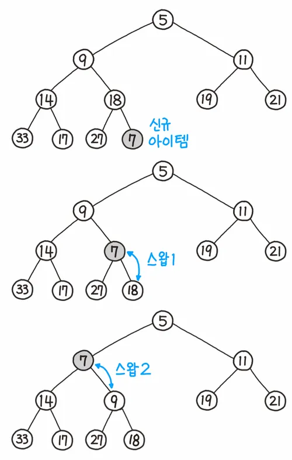
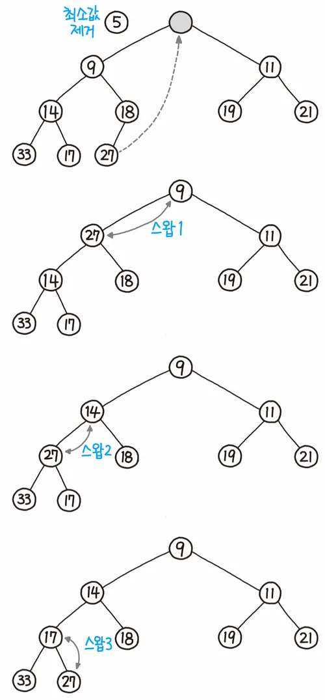

### 힙 트리란?
가장 크거나 가장 작은 값을 빠르게 찾기위한 완전 이진 트리 
루트에는 가장 크거나 작은 값이 저장되어 있다.

### 동작 원리
#### 데이터 삽입
1. 가장 끝의 자리에 노드를 삽입한다.
2. 그 노드와 부모 노드를 서로 비교한다.
3. 규칙에 맞으면 그대로 두고, 그렇지 않으면 부모와 교환한다.
4. 규칙에 맞을 때까지 3번 과정을 반복한다.

#### 데이터 삭제
1. 루트 노드를 제거한다.
2. 루트 자리에 가장 마지막 노드를 삽입한다.[3]
3. 올라간 노드와 그의 자식 노드(들)와 비교한다.
4. 조건에 만족하면 그대로 두고, 그렇지 않으면 자식과 교환한다.
5. 조건을 만족할 때까지 4의 과정을 반복한다.
